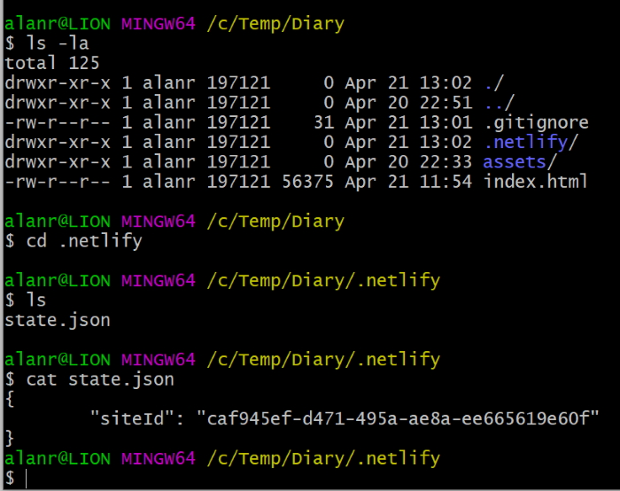

# Creating test websites

There are a couple of ways you can create test websites with live domains for free.

## Using Netlify for hosting your websites

> netlify.com

Netlify can be used both from a web UI and by using command line tools. I have had a quick look at the Netlify command line and it seems to be a bit more complicated than using the surge command line. Also it is only in beta at the moment.

To start with the web UI, head to https://app.netlify.com and sign in.

Click on your team name to manage your projects. From here you can click on a project or create a new project by dropping your project folder in the drag-drop area of the page.

This will setup a domain for you but you can change this.

You can also deploy from Github.

Hangman App:

https://todoapp-alanr.netlify.app/

### Change your site name

Click on your projects settings and in site details *change site name*.

I have changed Hangman to:

https://hangman-alanr.netlify.app

The nice thing about Netlify is that the URL is https.

### Installing Netlify CLI

Netlify now has a command line interface and that makes it easy to update your sites. To install Netlify CLI.

```bash
    npm install netlify-cli -g
```

You need to login.

```bash
    netlify login
```

This will popup an Authorize dialog box and connect you to your Netlify web account. Once this happens you are also logged in to the Netlify CLI.

### To link a local site to a Netlify site

If you have previous netlify sites and you want to link them to your development site use this command.

```bash
    netlify link
```

It will ask you for the Site Id. You can get this from the web page for your site, e.g.

[app.netlify.com/sites/alanrblog/settings/general](https://app.netlify.com/sites/alanrblog/settings/general)

It also asks for part of the website name.

```bash
    alanrblog
```

This will create a hidden Netlify folder with a **state.json** file in it. It contains the site id.



Now, when you update your site you can deploy it with:

```bash
    netlify deploy
```

This only updates the development site (I'll have to work out how to access this site).

To deploy to the production site.

```bash
    netlify deploy --prod
```

If you want to you can unlink the site.

```bash
    netlify unlink
```

I should now be able to create a site from the command line instead of going to the Netlify site.

I can also deploy from a site on Github.

## Using Surge for hosting your websites

> surge.sh

## Installing Surge

To install *surge* on your PC make sure you have node.js installed.

```bash
	npm install -g surge
```

## Create a website

Run surge from the folder you want to upload.

```bash
	npm run surge
```

or

```bash
	surge
```

First time you run this it will ask for an email address and password. It will create a URL for you and you can change the prefix if you want but only if the prefix is not in use.

notes-app:

> https://future-oven.surge.sh/

todo-app:

> https://alanr.surge.sh/
>
> I created one for Ethan to have a look at.
>
> https://ethanr.surge.sh/

### List all of your projects

```bash
    surge list
```

### Remove a website

I have created a website but wanted to remove it. You can do this by:

> surge teardown stimulating-pizzas.surge.sh

### Updating a project

You can update your project at any stage and reupload by running *surge* from the project folder again. It will give you a new domain but you can change it back to the old domain. For example if I want to update my todo app:

```bash
    surge --domain alanr.surge.sh
```

Another more efficient way of doing this is to create a CNAME file in the root of your application:

```bash
    echo alanr.surge.sh > CNAME
```

Now to install:

```bash
    surge
```
