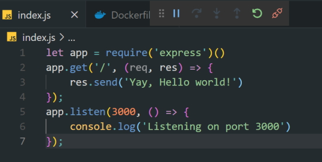

# Using Docker

Log in with your Docker account.

Get the version number.

```bash
    docker version
```

To see all Docker commands.

```bash
    docker
```

To see all your containers.

```bash
    docker container ls
```

Will list all of your containers.

To view information about your Docker installation.

```bash
    docker info
```

Let's create a container for engine-x

```bash
    docker container run -it -p 80:80 nginx
```

This worked but I had the following error.

> docker: Error response from daemon: Ports are not available: listen tcp 0.0.0.0:80: bind: An attempt was made to access a socket in a way forbidden by its access permissions.

I did some reading and found that it was conflicting with IIS (which also runs on port 80). To fix it I had to turn IIS off. Once I did this I was able to run the container with.

```bash
    docker container run -it -p 80:80 nginx
```

It didn't have to reinstall because nginx was on my local system. To test this we run ``localhost/`` in a browser.


This is running in a container it is not running on my machine.

To learn more about Docker images.

[Docker Hub](https://hub.docker.com).

Once you login search for ``nginx``.

You will see a list of images and the top one is the official nginx image.

If you click on this link you will see the Docker hub page for nginx.

We could have run ``docker pull nginx`` to run the command but the command we used created the container and pulled the nginx image as well.

You can stop the container from running with ``Ctrl-C``.

To see the containers that you have created.

```bash
    docker container ls -a
```


To delete a Docker container.

```bash
    docker rm bee1b83aa40d
```

To look at your Docker images.

```bash
    docker images
```

If you delete a container you will still have the nginx image on your system ready to run when you need it.

You can also delete your image.

```bash
    docker image rm 0839
```

or if it is still being held by the container you can.

```bash
    docker image rm -f 0839
```

You don't have to type in the full id.

If you just want to pull down the image.

```bash
    docker pull nginx
```

To run nginx in a container again. ``-d`` is detached.

```bash
    docker container run -d -p 8080:80 --name mynginx nginx
```

Now create an Apache server.

```bash
    docker container run -d -p 8081:80 --name myapache httpd
```

Apache isn't on our local machine so the command above will pull it down.

Also the web server runs on port 80 and the browser will run on port 8081. we use port 8081 because nginx is running on port 8080.


Run this command to see the containers that you have currently running.

```bash
    docker ps
```


Now you can see both containers running both of your web servers.

If you don't have any containers running and you want to see how many containers you have on your system.

```bash
    docker ps -a
```

Where **-a** means show all containers available. This is the same command as ``docker container ps -a`` or ``docker container ls -a``.

## Environment variables

Now we will create a container with a MySQL image and an environment variable. You can find these on the Docker MySQL hub page.

```bash
    docker container run -d -p 3306:3306 --name mysql --env MYSQL_ROOT_PASSWORD=123456 mysql
```

To stop a container without removing it.

```bash
    docker container mysql stop
```

If you do a ``docker ps`` now you won't see the mysql container in the list. If you now do a ``docker ps -a`` you will see the mysql container but it will say that you exited the container.

Now, if we want to remove a container while it is running.

```bash
    docker container rm myapache -f
```

You can actually enter your nginx container **when it is running**. This will show you web content in ``/usr/share/nginx/html`` .

```bash
    docker container exec -it mynginx bash
```

This will show you a bash prompt.


nginx is based on the Debian operating system image.

You can go in to the root folder of nginx.

```bash
    cd /usr/share/nginx/html
```

If you do an ``ls`` in this folder you will see the index.html file that appears when you run the web server. You could edit the page here but there is a better way to do this.

First, exit out of the container with ``exit``. Next delete all containers with the following command.

```bash
    docker rm $(docker ps -aq) -f
```

This didn't work for me in Windows but works in Linux.

## Bind Mounts

### Notes from Docker website

Bind mounts have been around since the early days of Docker. Bind mounts have limited functionality compared to volumes. When you use a bind mount, a file or directory on the host machine is mounted into a container. The file or directory is referenced by its absolute path on the host machine. By contrast, when you use a volume, a new directory is created within Docker's storage directory on the host machine, and Docker manages that directory's contents.

The file or directory does not need to exist on the Docker host already. It is created on demand if it does not yet exist. Bind mounts are very performant, but they rely on the host machine's filesystem having a specific directory structure available. If you are developing new Docker applications, consider using [named volumes](https://docs.docker.com/storage/volumes/ "named volumes") instead. You can't use Docker CLI commands to directly manage bind mounts.


On Linux I create a folder named ~/site-content

I copy my web content including an index.html file into this folder

```bash
   docker container run -d -p 8080:80 -v ~/site-content:/user/share/nginx/html nginx
```

The command above will run my image as a container and create a virtual link to my content and I can see this on localhost:8080.

This creates a virtual link to */user/share/nginx/html* in the container.

On Windows I have run this inside a folder named c:\temp\docker. I can ``code .`` and add my content.

Now if I run the website localhost:8080 I should see my web pages not the original nginx files.

### Creating a Dockerfile

I don't have to do this. I can also add files into this folder and then create a new **Dockerfile**.

```bash
    FROM nginx:latest

    WORKDIR /usr/share/nginx/html

    COPY . .
```

This will create a new image for me based on nginx. To build this.

```bash
     docker image build -t alanrob17/nginx-website .
```

This creates a new image for me. ``alanrob17`` is my Docker userId and I can use this to upload the image to Docker.

Check the images.


To run this container.

```bash
     docker container run -d -p 8080:80 --name alannginx alanrob17/nginx-website
```

Now when I run ``localhost:8080`` I should see the webpages I created.


### Pushing your image to Docker Hub

Once you push your image to Docker Hub you can restore it from anywhere in the world.

```bash
    docker push alanrob17/nginx-website
```


If you have problems and are asked to login all you have to do is.

```bash
    docker login
```

Go to [Docker Hub](https://hub.docker.com).


## Creating and running a VSCode Node.js Express application in Docker

I have generated a very basic Node.js Express server app.

Install

```bash
    npm init -y

    npm install express
```
### package.json

```json
    {
      "name": "node-server",
      "version": "1.0.0",
      "description": "",
      "main": "index.js",
      "scripts": {
        "test": "echo \"Error: no test specified\" && exit 1",
        "start": "node index.js"
      },
      "keywords": [],
      "author": "",
      "license": "ISC",
      "dependencies": {
        "express": "^4.17.1"
      }
    }
```

### index.js

```javascript
    let app = require('express')()
    
    app.get('/', (req, res) => {
        res.send('Yay, Hello world!')
    });
    
    app.listen(3000, () => {
        console.log('Listening on port 3000')
    });
```

I can run this app with.

```bash
    npm run start
```

This is just.

```bash
    node index.js
```

Test this is working and then shut the server down.

We can use a Docker command to build a container on the fly.

```vscode
    Ctrl-Shift-P
```

Select

```vscode
    Docker: Docker add files to Workspace...
```

This will ask you some questions and build a Dockerfile based on your answers.

Select application platform?

```bash
    Node.js
```

Choose a package.json file?

```bash
    root/package.json
```

What port does you application run on?

```bash
    3000
```

Include optional Docker compose file?

```bash
    No
```

After this a Dockerfile will be created.

### Dockerfile

```dockerfile
    FROM node:lts-alpine
    ENV NODE_ENV=production
    WORKDIR /usr/src/app
    COPY ["package.json", "package-lock.json*", "npm-shrinkwrap.json*", "./"]
    RUN npm install --production --silent && mv node_modules ../
    COPY . .
    EXPOSE 3000
    RUN chown -R node /usr/src/app
    USER node
    CMD ["npm", "start"]
```

Go to Debug and select ``Docker Node.js launch`` and click F5.


In the Terminal you will see the Dockerfile spinning up and when it finishes you will see The SHA id that was created for this container.

```terminal
    bbceebcee6de4ad533e362a251d1ff45afc2d4508bb497e0f8c09ee4b1b5d9d6
```

This runs the web site.


In powershell run the command.

```powershell
    docker container ls -a
```

This results in.

> CONTAINER ID: bbceebcee6de        
>       
> IMAGE nodeserver:latest       
>       
> COMMAND: "docker-entrypoint.s…"       
>       
> CREATED: 6 minutes ago        
>       
> STATUS: Up 6 minutes      
>       
> PORTS: 0.0.0.0:9229->9229/tcp, 0.0.0.0:49168->3000/tcp        
>       
> NAMES: nodeserver-dev

This shows us that the image, *nodeserver* with a name *nodeserver-dev* is running in a container at the moment.

**Note:** the container id matches the SHA id in the terminal

Also note that you listen for the app on port 3000 but the container runs the app on port 49168.

To stop the container in Visual Studio Code.



Click on the red disconnect icon shown above.

You could also stop the container with.

```powershell
    docker container nodeserver-dev stop
```
