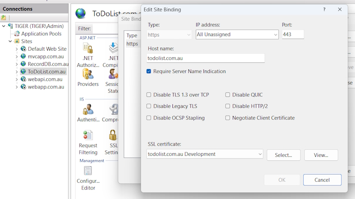

# Using Powershell to setup HTTPS on a website

**Note:** Always use Powershell Administrator.

For a test I am going to setup a certificate for ``todolist.com.au``.

I have a Host record.

```bash
    127.0.0.1 todolist.com.au
```

I have previously created a certificate but it isn't working correctly so I need to remove it.

First, go to **IIS** and change the bindings for the website. Add a new binding for ``http`` on port 80. Remove the ``https`` binding on port 443.

## Removing an expired certificate

Now if the certificate has expired you can remove it after you get its Thumbprint.

Check for expired certificates.

```bash
Get-ChildItem -Path "cert:\LocalMachine\My" | Where-Object { $_.NotAfter -lt (Get-Date) } | Format-Table Subject, Thumbprint, NotAfter
```

Returns.

> todolist.com.au 31919141CC571C7927759E9E88164BBDDE015BF8 CN=TIGER

I want to delete the todolist.com.au certificate.

Remove-Item -Path "cert:\LocalMachine\My\31919141CC571C7927759E9E88164BBDDE015BF8" -DeleteKey

This will delete the certificate. If you have used this certificate in **IIS** you will have to restart **IIS**.

```bash
    iisreset /restart
```

## Removing a current certificate

```bash
Get-ChildItem -Path "cert:\LocalMachine\My" | Format-Table FriendlyName, Thumbprint, Subject, NotAfter
```

Returns.

> todolist.com.au 31919141CC571C7927759E9E88164BBDDE015BF8 CN=TIGER

To remove the certificate.

```bash
    $thumbprint = "31919141CC571C7927759E9E88164BBDDE015BF8"
```

Then.

```bash
    Remove-Item -Path "cert:\LocalMachine\My\$thumbprint" -DeleteKey
```

This will have completely removed the certificate.

## An alternate way to remove the current certificate

This will make sure to remove the certificate from all certificate stores.

Create a script named ``removetodolist.ps1``.

```bash
$thumbprint = "31919141CC571C7927759E9E88164BBDDE015BF8"

# List of common stores to check
$stores = @("My", "Root", "WebHosting", "CA")

foreach ($store in $stores) {
    $cert = Get-ChildItem -Path "cert:\LocalMachine\$store" | 
            Where-Object { $_.Thumbprint -eq $thumbprint }
    if ($cert) {
        Remove-Item -Path $cert.PSPath -DeleteKey
        Write-Host "Removed from $store store"
    }
}
```

Run.

```bash
    .\removetodolist.ps1
```

This will remove the certificate from all certificate stores.

Once again restart **IIS**.

```bash
     iisreset /restart
```

## Installing a new Certificate

Creating a certificate through Powershell seems to be a better way to create a robust certificate.

To properly configure certificates for multiple local development sites (like recorddb.com.au and todolist.com.au), you need to include all relevant domains as Subject Alternative Names (SANs). Here's how to do it.

I create a script named ``createtodolist.ps1``.

```bash
# Create certificate with multiple SANs
New-SelfSignedCertificate `
    -DnsName "todolist.com.au", "localhost", "127.0.0.1", "todolist" `
    -CertStoreLocation "cert:\LocalMachine\My" `
    -FriendlyName "todolist.com.au Development" `
    -KeyUsage DigitalSignature, KeyEncipherment `
    -KeyAlgorithm RSA `
    -KeyLength 2048 `
    -NotAfter (Get-Date).AddYears(2) `
    -TextExtension @("2.5.29.37={text}1.3.6.1.5.5.7.3.1") `
    -Provider "Microsoft Enhanced RSA and AES Cryptographic Provider"
```

Run.

```bash
    .\createtodolist.ps1
```

Returns.

>   PSParentPath: Microsoft.PowerShell.Security\Certificate::LocalMachine\My        
>       
> Thumbprint                                Subject              EnhancedKeyUsageList       
> ----------                                -------              --------------------       
> B1407E4F61E93ED3717CE4E8431910BB2FEE1A18  CN=todolist.com.au   Server Authentication

You can check that the certificate exists.

```bash
Get-ChildItem -Path "cert:\LocalMachine\My" | Format-Table FriendlyName, Thumbprint, Subject, NotAfter
```

Returns.

> todolist.com.au Development B1407E4F61E93ED3717CE4E8431910BB2FEE1A18 CN=todolist.com.au

This gets saved in the Personal Store and we need to export it to the Trusted Root Store. To do this you export the certificate and save it in ``C:\Cert``. This time it saves the certificate as ``todolist.com.au.pfx``. It also requires a password. I have saved this in my SecureSafe passwords.

Now I need to import this key into the TrustedRoot certificate store. 

**Note:** It is important to do this because it won't be trusted if you don't!

Click on the certificate.

Store location: Current User

Add the certificate (todolist.com.au.pfx).

Add the password and mark the key as exportable.

Place all Certificates in the following store: ``Trusted Root Certification Authority``.

## Set up your certificate in IIS

In the bindings section add a new certificate.



**Note:** Require Server Name Indication needs to be checked.

Remove the ``http`` port 80 binding.

Now you should have a secure website.

**Note:** the following notes should be redundant. I have left them as an alternative way to create a certificate.

## Using IIS to setup HTTPS on a website

**Note:** I have previously setup my website in IIS and added a record in my ``hosts`` file to map to my website name.

```bash
    127.0.0.1 RecordDB.com.au
```

## Install Microsoft URLRewrite

Go to IIS website and download the URLRewrite executable. Install it on your machine and now go to your IIS console and select your website (in my case it will be ``recorddb.com.au``).

You should see this in your website settings.


## Obtain a certificate

Go to the Root of your IIS server and click on **Server certificate**.


This opens the following dialog.


Add a friendly name, ``recorddb.com.au`` and make sure **personal** is selected. You will then see a list of all your personal certificates.


On your website in IIS right-click and select **Edit Bindings** to add a new SSL binding.


Remove the port 80 binding.

## Running your website

You can now use **https** to serve your website by clicking on the **Browse Website** option. Make sure to select the **https** link.


You will get a browser error of *Potential Security Risk Ahead*. Continue on and ignore this.

Your browser displays an error page because the self-signed certificate was issued by your computer, not by a trusted Certificate Authority (CA). Browsers will trust the certificate if you add it to the list of Trusted Root Certification Authorities in the certificates store it on the local computer, or in Group Policy for the domain.

You can see your certificate in Certificate Manager.


**Note:** In Firefox you see you link as.


If you click on the certificate it tells you that the connection isn't secure. Chrome, Brave and Edge will have a line through **https** to let you visually know that the site isn't secure.

## URL Rewrite

Normally we would finish here but I am going to add a **URL Rewrite** rule to our website.

Click on **URL Rewrite** in your website. Add a new blank rule named **Http Redirect**.

The setting are.


Now if a user uses the URL, **<http://recordb.com.au>** it will be redirected to **<https://recordb.com.au>**

## More notes

The method I used above worked fine for the first time I created a certificate but failed when I went to renew the certificate.

I ended up creating the new certificate using Powershell Admin.

## Create the certificate

```bash
New-SelfSignedCertificate -DnsName "recorddb.com.au" -CertStoreLocation "cert:\LocalMachine\My"
```

This produced the following output

> FB8A486DE7A5769CDADA6BBCE38C1528E2A75A54  CN=recorddb.com.au   {Client Authentication, Server Authentication}

Where the first value was the thumbprint, (FB8A486DE7A5769CDADA6BBCE38C1528E2A75A54).

Add the thubprint to the following code.

```bash
$thumbprint = "FB8A486DE7A5769CDADA6BBCE38C1528E2A75A54"
Export-Certificate -Cert "cert:\LocalMachine\My\$thumbprint" -FilePath "C:\Cert\recorddb.cer"
```

This worked fine but the next step failed.

## Import to Trusted Root (so browser will trust it)

```bash
Import-Certificate -FilePath "C:\Cert\recorddb.cer" -CertStoreLocation "cert:\LocalMachine\Root"
```

This step didn't add the certificate to Trusted Root.

To get around this I had to double-click on the certificate in ``C:\Cert`` and click on the ``Install Certificate`` button.

I then used local user and the select the option to `place all certificates in the following store`. This allowed me to save the certificate in the `Trusted Root Certificate Authorities`.

This worked!

I then opened the website using ``https`` and it had a secure certificate.

## Final thoughts

**Note:** Use ``certlm.msc`` to view your keys.

It is a bit frustrating that I can't create the self-signed certificate in Internet Information Server. When I did this I could see the certificate in the Trusted Root certificate area but it wasn't working.

In future I will use Powershell to create new certificates and manually install the certificate.

I asked Deepseek why it didn't install the certificate in the Trusted Root Authority and it said to manually install it instead. It also came up with a more complex script to install the certificate.

```bash
# Create certificate with extended properties
$cert = New-SelfSignedCertificate `
    -DnsName "recorddb.com.au" `
    -CertStoreLocation "cert:\LocalMachine\My" `
    -FriendlyName "recorddb.com.au Local Dev" `
    -KeySpec Signature `
    -KeyUsage DigitalSignature `
    -KeyUsageProperty Sign `
    -KeyAlgorithm RSA `
    -HashAlgorithm SHA256

# Export to file
$certPath = "cert:\LocalMachine\My\$($cert.Thumbprint)"
Export-Certificate -Cert $certPath -FilePath "C:\Cert\recorddb.cer" -Type CERT

# Import to Trusted Root
$import = Import-Certificate -FilePath "C:\Cert\recorddb.cer" -CertStoreLocation "cert:\LocalMachine\Root"

# Verify installation
Get-ChildItem -Path "cert:\LocalMachine\Root" | Where-Object { $_.Thumbprint -eq $cert.Thumbprint }
```

**Note:** I can select and delete expired certificates by first running this command.

```bash
Get-ChildItem -Path "cert:\LocalMachine\My" | Where-Object { $_.NotAfter -lt (Get-Date) } | Format-Table Subject, Thumbprint, NotAfter
```

This lists expired keys.

> Subject              Thumbprint                               NotAfter      
> -------              ----------                               --------      
> CN=TIGER             A892DAD321720FB30E2898D706F8929E580AF6BD 29/01/2024 11:00:00 AM        
> CN=*.asus.com,       A4AF32429792FC94BF0688E3217E5DB13194CFF0 28/06/2022 1:06:58 PM     
> CN=localhost         911948522985599A7FF3F8C6E65C06B365DD0BE4 26/10/2022 12:29:16 PM        
> CN=TIGER             6B12C2C301F23E86F2A71844533645FA3F8228D7 29/01/2024 11:00:00 AM        
> CN=RecordDB.com.au   66E07744401E383FC4096645BB11560915C32F3F 1/03/2025 4:46:50 PM      
> CN=TIGER             60027298EC4F8D163B9CB4CC1EF7C260663CBCD1 29/01/2024 11:00:00 AM

I want to delete the ``RecordDB.com.au`` certificate.

```bash
Remove-Item -Path "cert:\LocalMachine\My\66E07744401E383FC4096645BB11560915C32F3F" -DeleteKey
```

This deletes the key and now you need to restart IIS.

```bash
    iisreset /restart
```

This works and removed the expired certificate from IIS. Do this next time your certificate expires and it will make it easier to create a new certificate.
