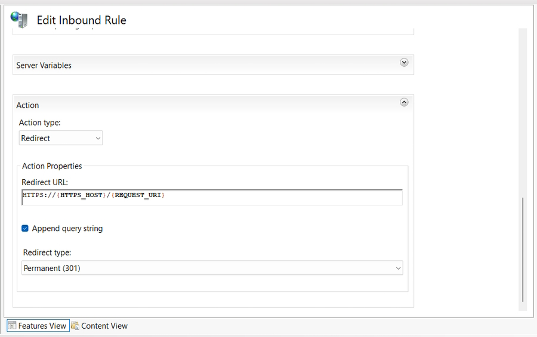
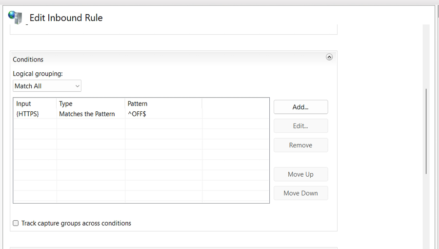

# Using IIS to setup HTTPS on a website

**Note:** I have previously setup my website in IIS and added a record in my ``hosts`` file to map to my website name.

```bash
    127.0.0.1 RecordDB.com.au
```

## Install Microsoft URLRewrite

Go to IIS website and download the URLRewrite executable. Install it on your machine and now go to your IIS console and select your website (in my case it will be ``recorddb.com.au``).

You should see this in your website settings.


## Obtain a certificate

Go to the Root of your IIS server and click on **Server certificate**.


This opens the following dialog.


Add a friendly name, ``recorddb.com.au`` and make sure **personal** is selected. You will then see a list of all your personal certificates.


On your website in IIS right-click and select **Edit Bindings** to add a new SSL binding.


Remove the port 80 binding.

## Running your website

You can now use **https** to serve your website by clicking on the **Browse Website** option. Make sure to select the **https** link.


You will get a browser error of *Potential Security Risk Ahead*. Continue on and ignore this.

Your browser displays an error page because the self-signed certificate was issued by your computer, not by a trusted Certificate Authority (CA). Browsers will trust the certificate if you add it to the list of Trusted Root Certification Authorities in the certificates store it on the local computer, or in Group Policy for the domain.

You can see your certificate in Certificate Manager.


**Note:** In Firefox you see you link as.


If you click on the certificate it tells you that the connection isn't secure. Chrome, Brave and Edge will have a line through **https** to let you visually know that the site isn't secure.

## URL Rewrite

Normally we would finish here but I am going to add a **URL Rewrite** rule to our website.

Click on **URL Rewrite** in your website. Add a new blank rule named **Http Redirect**.

The setting are.






Now if a user uses the URL, **<http://recordb.com.au>** it will be redirected to **<https://recordb.com.au>**
