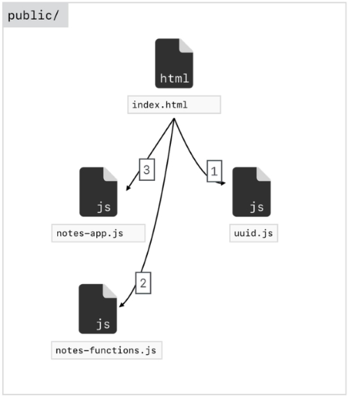

# Installing Babel

```bash
	npm install -g babel-cli

	babel --version
```

Go to the folder you want to use Babel in (ours is *js-bootcamp/boilerplate*).

We have a file we want to transpile named *input.js*.

```bash
	babel input.js -o output.js
```

*output.js* is our output file.

If you look at *output.js* you will notice that it has hardly changed.

We need to create a project file and we can do that by running:

```bash
	npm init
```

Accept all the defaults and it will create a *package.json* file.

Now we need to add a Babel preset (locally only).

```bash
	npm install babel-preset-env@1.6.1
```

This installs the preset version 1.6.1 in the *node_modules* folder. If you look at your *package.json* file again you will notice that it has added a dependency which is the preset we installed.

```json
	"dependencies": {
		"babel-preset-env": "^1.6.1"
	} 
```

We also have a new file added to our root folder named *package-lock.json*. This keeps track of the version of modules we are using in case there are conflicts in the future.

Now we can run our transpiler command again with our new preset.

```bash
	babel input.js -o output.js --presets env
```

or

```bash
	babel input.js --out-file output.js --presets env
```

Now you will notice that there is a big difference in *output.js*.

This is a modified version of our file that is going to work in a wider range of browsers.

Once we have transpiled our .js files we can delete the *node_modules* folder. We don't really need it anymore.

If you need to transpile again in the same folder just run this command to get the *node_modules* folder back.

```bash
	npm install
```

You don't need the preset part of the line anymore because when *npm* is installing it will look at your package.json file and automatically install dependencies. This makes it easy to pass our projects around.

We are now going to change our folder structure.

Add in a **public** folder which will contain our web application, that is everything that we need to send to our server. Inside of *public* create a **js** folder.

The next folder will be **src** which will contain all of our js code before we send it to Babel.

Inside the *public* folder we are going to put in all of the js code that was processed by Babel.

Rename *input.js* to *index.js* and put in in the *src* folder. Delete *output.js*.

Compile your code with:

```bash
    babel src/index.js -o public/js/bundle.js --presets env
```

This is the long handed way of compiling. We can add this command into *package.json*.

```json
    {
      "name": "boilerplate",
      "version": "1.0.0",
      "description": "",
      "main": "input.js",
      "scripts": {
        "build": "babel src/index.js -o public/js/bundle.js --presets env"
      },
      "author": "",
      "license": "ISC",
      "dependencies": {
        "babel-preset-env": "^1.6.1"
      }
    }
```

We can then run this command as many times as we want:

```bash
    npm run build
```

To get our code to run we will build an **index.html** file in our *public* folder.

Link *bundle.js* into *index.html* and change the *index.js* file to:

```javascript
    'use strict';

    const name = 'Alan';

    console.log(name);

    class Hangman {
        myMethod() {
            return 'Testing...';
        }
    }

    const hangman = new Hangman();

    console.log(hangman.myMethod());
```

Re-compile the js code and run the program.

> Alan      
> Testing...

Is printed in the console.

Internet Explorer doesn't have classes built into its version of JavaScript but now that we have transpiled our code we can run it in Internet Explorer.

Once again we wouldn't want to manually compile our JavaScript code each time we made a change to our code. Fortunately we can set this up in *package.json* to automatically compile for us. Change our build line to:

```json
    "build": "babel src/index.js -o public/js/bundle.js --presets env --watch"
```

Now we run *npm run build* again.

This time the script keeps running until we close it down.

To see this work change your name in *index.js* to James and look at the console in your browser.

It produces the following result:

> James     
> Testing...

## Avoiding Global Modules

Babel and Live Server were both installed globally on my PC. This makes it hard if I want to give my whole package away for use on another PC.

We can uninstall global modules and then install them as local dependencies for our project.

## Webpack

We have minor issues with multiple JavaScript files in a project. The main problem is that you have to load each JavaScript file into your HTML file in a particular order.

### Current workflow



In the Notes app we have three JavaScript files and an Index HTML file. The JavaScript files have to be loaded in order into our HTML file..

1. uuid.js
2. notes-app.js
3. notes-functions.js

Webpack allows us to work around this issue so we will be using it instead of Babel for organising our project. We still be using Babel to compile our code though.

### New workflow


The folder structure is similar to our Boilerplate example.

* public
* src
* node_modules

In this case we will be using uuid as a node_module so we won't need to bring in the file as we did previously.

We will use Webpack to combine our three JavaScript files into one compiled file named **bundle.js**. Webpack can do more than compile our JavaScript files. It also compiles SASS into CSS.

## Setting up Webpack

The website is [webpack.js.org](https://webpack.js.org/). The most important part of this website is the documentation.

In this case we are going to install Webpack locally into our boilerplate app.

```bash
    npm install webpack@4.5.0 webpack-cli@2.0.14
```

Webpack will make changes to our *package.json* configuration file.

Once we have Installed Webpack we can configure it. Like Babel we have to let Webpack know where our source code resides and where to save the generated code. We do this in a separate config file.

We are going to be running Webpack via a script similar to the way we run Babel. We add it to *package.json*.

```json
    {
      "name": "boilerplate",
      "version": "1.0.0",
      "description": "",
      "main": "input.js",
      "scripts": {
        "webpack": "webpack",
        "build": "babel src/index.js -o public/js/bundle.js --presets env --watch"
      },
      "author": "",
      "license": "ISC",
      "dependencies": {
        "babel-preset-env": "^1.6.1",
        "webpack": "^4.5.0",
        "webpack-cli": "^3.3.9"
      }
    }
```

We don't want to add a long command to tell Webpack where the code resides and how to compile inside of *package.json* so we will create a new JavaScript file named **webpack.config.js**  in the root folder to do this.

We use *node.js* commands in this file.

The entry path must use relative paths to get to our files.

The output path must use an absolute paths to compile the code to. The problem with this is that it breaks if we move our project or give it to somebody else.

Fortunately *node.js* gives us a way to do this.

```javascript
    const path = require('path');

    module.exports = {
        entry: './src/index.js',
        output: {
            path: path.resolve(__dirname, 'public/js');
        }
    }

    // /d/WebDev/JavaScript/js-bootcamp/boilerplate
```

We need to use a node.js module to get the path information.

```javascript
    const path = require('path');
```

To get the absolute path we use a node.js variable named **__dirname**.

To get around the different operation systems you could be working on we use the method **path.resolve()** with two arguments. The first is the absolute path to our root and the next argument is the folder we want our compiled code to reside in.

```javascript
    path: path.resolve(__dirname, 'public/js');
```

We are now ready to start working.

```bash
    npm run webpack
```

This will grab our *webpack.config.js* file and then run our code successfully. It creates a file named **main.js** which is a minified version of our compiled code.

We can ren name this file by adding a line to our configuration.

```javascript
    const path = require('path')

    module.exports = {
        entry: './src/index.js',
        output: {
            path: path.resolve(__dirname, 'public/js'),
            filename: 'bundle.js'
        }
    }
```

Now rerun the webpack command to recompile our code and you will see the minified *bundle.js* file.
