# Use Grep for Fast Search from the Command Line

## Search The Contents Of Files Using Grep

For most of my grep searches I will use the following command.

```bash
    grep --color -in
```

* **--color** for colour output.
* **-i** for case-insensitive.
* **-n** for line numbers.

Grep is helpful for searching through projects. Our first example is searching for information in a **package.json** file.

### Find version number

```bash
    grep version package.json
```

> "version": "0.1.1",

Breaking that command down we have.

* **grep** is the program name.
* **version** is the text we are searching for.
* **package.json** is the file we are searching trough.

### Find all gulp references

```bash
    grep --color -in gulp package.json
```

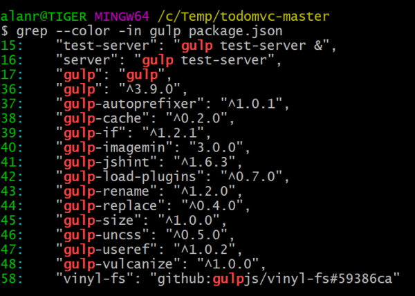

### search markdown files for headings

```bash
    grep "#" app-spec.md contributing.md code-of-conduct.md
```

#### Partial output

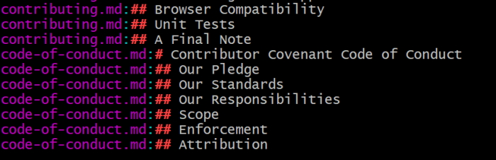

Can also search using glob patterns.

```bash
    grep "#" *md
```

This will search through all ``md`` files in the current directory.

## Search Directory Contents Using Grep

```bash
     grep toggle ./*
```

This will give us some results but it won't search through all directories.

```bash
    grep -r toggle .
```

This will now let us search through all files in all directories recursively which returns way too much information.

We can drill down with.

```bash
    grep -r toggle examples/react/js
```


This searches all files in the directory, *examples/react/js*.

## Search For Filename Patterns Using Find

We can search for all files with a particular extension.

```bash
    find . -name "*jsx"
```

> ./examples/react/js/app.jsx       
> ./examples/react/js/footer.jsx        
> ./examples/react/js/todoItem.jsx      
> ./examples/react-alt/js/app.jsx       
> ./examples/react-alt/js/footer.jsx        
> ./examples/react-alt/js/todoItem.jsx      
> ./examples/react-backbone/js/app.jsx      
> ./examples/react-backbone/js/footer.jsx       
> ./examples/react-backbone/js/todoItem.jsx

This is the list of files that it found with a ``.jsx`` extension.

**find** works differently to the **grep** command. First we specify where we are searching, then what we are searching for.

## Search Matching Files By Combining Find And Grep With Xargs

**find** will search for all files with a particular pattern.

```bash
    find examples/ -name "*Spec.js"
```

#### Result

> examples/angularjs/test/unit/directivesSpec.js        
> examples/angularjs/test/unit/todoCtrlSpec.js      
> examples/angularjs_require/test/unit/directives/todoEscapeSpec.js     
> examples/angularjs_require/test/unit/directives/todoFocusSpec.js      
> examples/vanillajs/test/ControllerSpec.js

Now, we can pipe that result into **xargs** and what **xargs** does is execute a command on the piped output. We are now going to run grep on the output.

```bash
     find examples/ -name "*Spec.js" | xargs grep "describe"
```


You could do this using grep by itself.

```bash
    grep -r --include="*Spec.js" "describe" examples/
```

This command isn't as intuitive as the one using **find**.

The other benefit over the previous command is that you can run the **find** part of the command first and when you are satisfied that you are getting the correct pattern of files back you can then pipe them to grep to search those particular files.

## Search The Contents Of A Git Repository With Git Grep

When searching through Git projects we can use Git's grep and that will use the *.gitignore* file to ignore files that we don't want to search like the *node_modules* directory.

```bash
    git grep import
```

#### Partial results

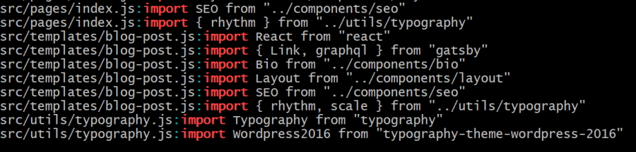

## Show Context Around Matches Using Grep

Remember our header search in markdown files?

```bash
    grep "#" *md
```

This will give me a listing of all headers in markdown files. What if I want more context? I can add numbering to find out where the headers appear in a particular markdown file. This will help me if I want to navigate to a header in a file in my text editor.

```bash
    grep -n "#" *md
```

``-n`` will add line numbers

> readme.md:46:#### [Sam Saccone](https://github.com/samccone) - Developer      
> readme.md:51:#### [Arthur Verschaeve](https://github.com/arthurvr) - Developer        
> readme.md:56:#### [Fady Samir Sadek](https://github.com/FadySamirSadek) - Developer       
> readme.md:61:#### [Gianni Chiappetta](https://github.com/gf3) - Logo designer     
> readme.md:66:## Disclaimer        
> readme.md:77:## Getting Involved      
> readme.md:84:## License

Another form of context will be to add content around the match and we can do this with.

```bash
    grep -n -A 2 "#" *md
```


**-A 2** will add two lines of content **after** the matched line so that you can see some context around the match.

```bash
    grep -n -A 2 -B 2 "#" *md
```

This will add two lines of context before and after the match.


An easier way to do this is use the following command to give you the before and after context.

```bash
    grep -n -C 2 "#" *md
```

## Search For Basic Patterns Using Grep

The first basic pattern we will use is the . (dot) pattern.

```bash
    grep --color "h." readme.md
```


The . (dot) pattern matches any character so it picks up an **h** plus ant character after that **h**.

```bash
    grep --color "http." readme.md
```

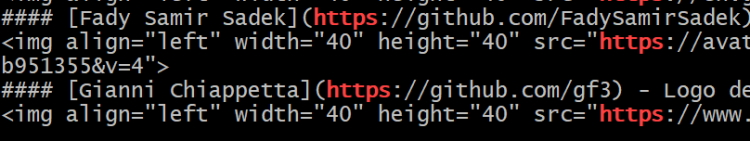

What if you want to search for a literal dot?

```bash
    grep --color "\.com" readme.md
```


The next special character is the ``*`` (star) character.

```bash
    grep --color "#*" readme.md
```


This pattern ``#*`` finds the first hash and then all other hashes after it.

**Note:** if there are more hashes in a line of text then the pattern will find the first match and then ignore all other characters until it finds the next hashes in the line.


You can use multiple special characters in your pattern.

```bash
    grep --color "(.*)" readme.md
```

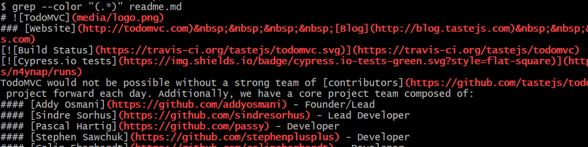

This will find all characters within the bracket pattern. Note that if there are multiple bracket patterns on one line then all characters within both bracket patterns will also be caught,

## Search For More Complex Patterns With Regex In Grep

Another special character you can use in you patterns are the ``?`` and ``+`` characters. These determine how many times a pattern should match.

originally we used the dot (.) character to specify the next character.

```bash
    grep "http." readme.md
```

This will catch https and http: which may not be what we want to catch.

We can do this more cleanly with.

```bash
    grep --color "https\?" readme.md
```

This will catch either **http** or **https**, not the **http:** pattern

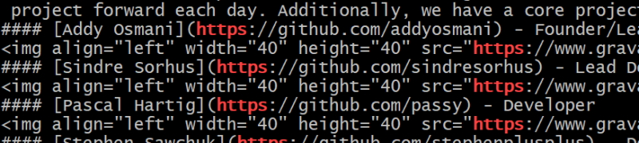

The question mark says match this character zero or one time. So match the "s" zero or one time in the pattern.

**Note:** we have to escape the question mark with a backslash.

The next special character is the ``+`` sign. This says match the character one or more time in the pattern

```bash
    grep --color "https\+" readme.md
```

So now we match the "s" one or more times, so in our search this time we won't match **http**.


If we search for the # sign with a pattern of "#\+" we will get the following.

```bash
    grep --color "#\+" readme.md
```

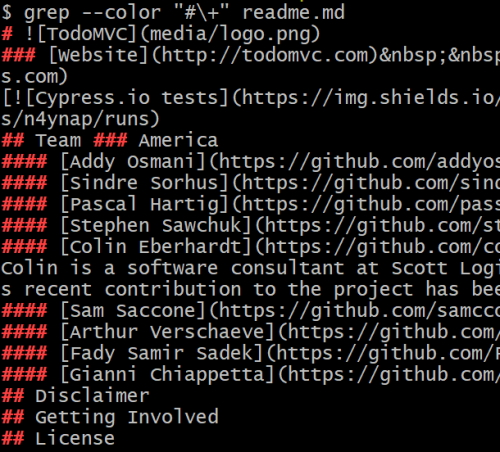

This will give us a list of all headers but if we change this to:

```bash
    grep --color "###\+" readme.md
```

And we get:

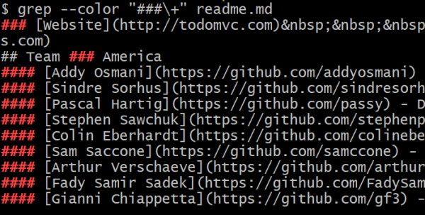

This pattern says search for 2 hashes and then a third pound or more. It will catch hashes with 3 or more hashes.

We do we have to escape ``?`` and ``+`` but not the ``.`` or ``*`` characters? This is because grep handles the ``.`` and ``*`` as basic regular expressions and the ``?`` and ``+`` are classed as extended regular expressions.

We could get around this with an ``E`` flag.

```bash
    grep --color -E "###?" readme.md
```

or.

```bash
    grep --color -E "###+" readme.md
```

It is probably easier to escape the extended characters.

## Search For Optional Patterns With Grep Or

We can use optional regular expression patterns to search for more than one option.

```bash
    echo "Is it grey or gray?" | grep --color "grey\|gray"
```

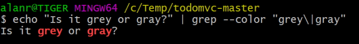

Once again the ``|`` (or) characters is an extended regular expression character so we escape it or use the ``-E`` flag.

Now we will do another optional search using the recursive flag to search all directories in *examples/*

```bash
    grep --color -r "grey\|gray" examples/
```


## Specify Line Beginning And End In Patterns Using And With Grep

When we have been searching for hash characters so far we have been searching for characters anywhere in our file. We can specify anchor tags to search at the start or end of a file.

```bash
    grep --color "#" app-spec.md
```

Will find hash characters anywhere in the file.


We can get more specific, for example search for a hash character as the first character in a line with the ``^`` anchor tag.

```bash
    grep --color "^#" app-spec.md
```

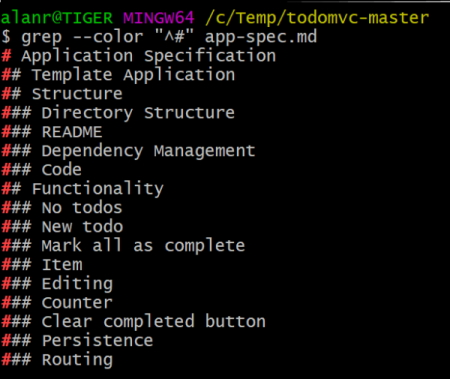

To search at the end of a line.

```bash
    grep --color ",$" app-spec.md
```


We can combine different patterns to find more complicated search strings. For example find the ES6 import statements in a file.

```bash
    grep --color -r "^import .* from" examples/
```

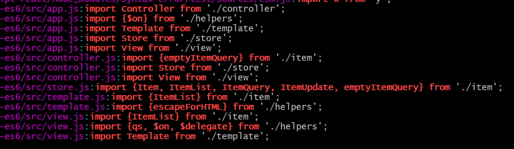

## Search For Classes Of Characters Using Bracket Expressions With Grep

If you want to match a whole class of characters the you can use characters in grep.

```bash
    echo "abc123" | grep --color "[ab]"
```

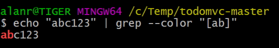

This is checking for the characters ``a`` or ``b``.

```bash
    echo "abc123acb" | grep --color "[ab]"
```

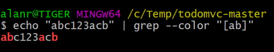

You can match all lowercase characters with.

```bash
    echo "abc123acb" | grep --color "[a-z]"
```


The following expression will match ``123``.

```bash
    echo "abc123acb" | grep --color "[1-9]"
```

Let's combine these to make a more complex expression.

```bash
    grep --color "de[a-z]*er" readme.md
```

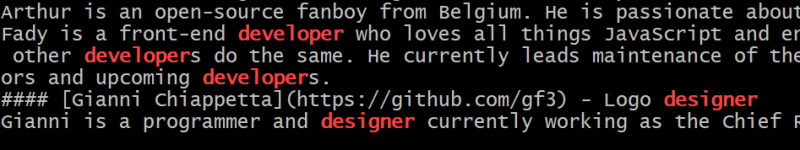

This matches the words *developer* and *designer*. We have two literal strings, ``de`` and ``er`` and then we match any number of alphabetical characters that start and end with the two literal strings.

Instead of typing in **a-z** there are some built in classes that you can use.

```bash
    grep --color "de[[:alpha:]]*er" readme.md
```

``[:alpha:]`` means the alphabetic characters.

**Note:** that this will match uppercase and lowercase alpha characters.

We can do a case insensitive search using brackets.

```bash
    find . -name "*js" | grep --color "[sS]pec"
```

This means find **spec** or **Spec**.


## Search With Groups Using Grep

Earlier we learnt how to search optional patterns using the optional bar.

```bash
    grep -rE --color "grey|gray" .
```

This is good for simple searches but what if we want to search for more options. We will have to use grouping.

This statement searches for grey OR gray OR resolved with a closing double quote.

```bash
    grep -rE --color "(grey|gray)|(resolved)\"" .
```


Another set of grouping options.

```bash
    grep -rE --color "(grey|gray)(-|\")" .
```

We search for grey OR gray followed by either a **-** or **"**.


We can get even more descriptive with our groupings.

```bash
    grep -rE --color "(grey|gray)(\'|\"): (\'|\")#?[[:xdigit:]]+" .
```

**Note:** this didn't work for me. I had to unescape the single quotes.

```bash
    grep -rE --color "(grey|gray)('|\"): ('|\")#?[[:xdigit:]]+" .
```

Results.


## Find Matches Excluding A Pattern With grep -v

Have a look at all the JavaScript files in the angularjs example.

```bash
    find examples/angularjs -name "*js"
```

Returns.

> examples/angularjs        
> examples/angularjs/js     
> examples/angularjs/js/app.js      
> examples/angularjs/js/controllers/todoCtrl.js     
> examples/angularjs/js/directives/todoEscape.js        
> examples/angularjs/js/directives/todoFocus.js     
> examples/angularjs/js/services/todoStorage.js     
> examples/angularjs/node_modules/angular/angular.js        
> examples/angularjs/node_modules/angular-resource/angular-resource.js      
> examples/angularjs/node_modules/angular-route/angular-route.js        
> examples/angularjs/node_modules/todomvc-common/base.js        
> examples/angularjs/test/config/karma.conf.js      
> examples/angularjs/test/unit/directivesSpec.js        
> examples/angularjs/test/unit/todoCtrlSpec.js

We are only interested in the application code and we don't want to search for files in *node_modules*.

We can do this bt piping our initial results into grep and using the inverse pattern matching ``-v``.

```bash
    find examples/angularjs -name "*js" | grep -v "node_modules"
```

Returns.

> examples/angularjs        
> examples/angularjs/js     
> examples/angularjs/js/app.js      
> examples/angularjs/js/controllers/todoCtrl.js     
> examples/angularjs/js/directives/todoEscape.js        
> examples/angularjs/js/directives/todoFocus.js     
> examples/angularjs/js/services/todoStorage.js     
> examples/angularjs/test/config/karma.conf.js      
> examples/angularjs/test/unit/directivesSpec.js        
> examples/angularjs/test/unit/todoCtrlSpec.js

In this example instead of matching everything that matches we are matching everything that doesn't match.

```bash
    find examples -name "*js" | grep -vE "node_modules|[S|s]pec"
```

In this case we knockout any files with *node_modules* and the words *Spec* or *spec*.
