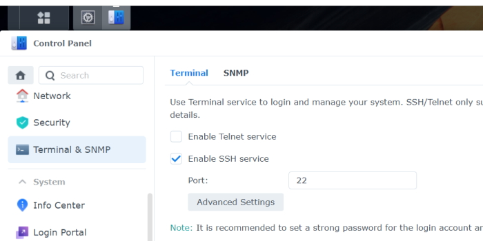
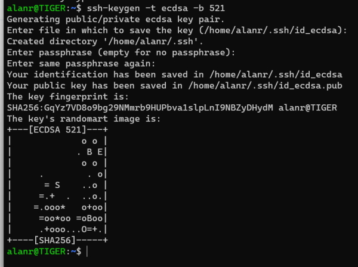
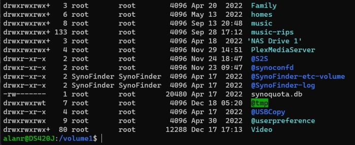
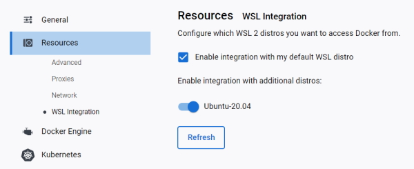

# Windows Subsystem for Linux Deep Dive

## Installing WSL on Windows 11

Installing the default Linux (Ubuntu).

```bash
	wsl --install
```

List online versions of Linux.

```bash
	wsl --list --online
```

List your Linux installations.

```bash
	wsl --list
```

Returns.

> Windows Subsystem for Linux Distributions:
> Ubuntu-20.04 (Default)
> docker-desktop
> docker-desktop-data

Installing a version of Linux.

```bash
	wsl --install -d <Distribution name>
```

e.g.

```bash
	wsl --install -d kali-linux
```

Once you install this it will ask you for a username and password for this version of Linux.

## Removing a Linux installation

```bash
	wsl --unregister Ubuntu-20.04
```

**Note:** this will remove everything including your preferences.

Check the status of your WSL installation.

```bash
	wsl --status
```

Returns.

> Default Distribution: Ubuntu-20.04
> Default Version: 2

Shows that I am running WSL 2.

The version of Ubuntu I am running can be found with.

```bash
	lsb_release -a
```

Returns.

> No LSB modules are available.
> Distributor ID: Ubuntu
> Description:    Ubuntu 20.04.3 LTS
> Release:        20.04
> Codename:       focal

### Help

```bash
	wsl --help
```

## First steps with a Distro

### Updates

Updates are released quicker than Microsoft can do their package updates. To do updates you can use the Linux distributions process.

```bash
	sudo apt update && sudo apt upgrade
```

### Generating a SSH key

The system keys are kept in and these should be all you need.

> /etc/ssh

Use a ECDSA key with a size of 521 bytes.

```bash
	ssh-keygen -t ecdsa -b 521
```

This allows you to use the SSH keys to log into Linux or Unix systems.

### Generating a key for my NAS

You have to enable SSH on your NAS.



Now, generate a key.

```bash
	ssh-keygen -t ecdsa -b 521
```



Now run the following to see your key.

```bash
	ll .ssh
```

> total 16
> drwx------  2 alanr alanr 4096 Dec 18 14:46 ./
> drwxr-xr-x 25 alanr alanr 4096 Dec 18 14:46 ../
> -rw-------  1 alanr alanr  736 Dec 18 14:46 id_ecdsa
> -rw-r--r--  1 alanr alanr  265 Dec 18 14:46 id_ecdsa.pub

I can copy the SSH key to the server.

```bash
	ssh-copy-id 192.168.1.3
```

This asks for a password on the NAS. Once you do this it will copy the SSH key to the NAS.

Now you can log in without using a password.

```bash
	ssh 192.168.1.3
```

Screenshot.



## Using Docker with WSL

Docker is integrated into WSL 2.

You can run Docker from inside your WSL instances.

### Settings

We are running Linux images.

In Docker General settings check the **Use the WSL 2 based engine** setting.

In Resources settings.



## Using Windows and Linux commands

### Using Linux commands inside of Windows

In Powershell I can update my default Linux instance with.

```bash
	wsl sudo apt update -y
```

And.

```bash
	wsl sudo apt upgrade -y
```

All you need to do to run a linux command is add the ``wsl`` at the front of the command.

I can edit my Ubuntu ``.bashrc`` from Powershell.

```bash
	wsl nano ~/.bashrc
```

**Note:** if you have multiple instances of Linux running you can change the instance by using the name.

```bash
	wsl -d Ubuntu-20.04 cat ~/.bashrc
```

This will list the .bashrc file on Ubuntu.

I can use Linux commands on Windows folders using the default instance of Ubuntu.

```bash
	wsl grep -in "Dylan" *.txt
```

Uses the Linux version of grep to find text files with the word ``Dylan`` in them.

### Using Windows commands inside of Linux

You can use Windows commands directly in WSL Linux.

```bash
	dir
```

Will run in your Ubuntu instance.

In Powershell run this Linux command to create a Windows text file.

```bash
	 wsl vim test.txt
```

View the file.

```bash
	 wsl cat test.txt
```

Returns the text file contents.

> PS C:\Temp\a> cat test.txt
> This is a new windows text file created using VIM.

## File systems

Files in your Linux system are accessible in Windows.

The files in your Windows system are accessible in Linux.

**Note:** you get better performance from your native file system.

Keep your Windows files in Windows and Linux files in Linux.

You can access the Linux file system from Powershell.

```bash
dir \\wsl$\Ubuntu-20.04
```

or

```bash
	dir \\wsl.localhost\Ubuntu-20.04
```

Will list the files in Ubuntu.

You can access any Linux file system using ``\\wsl$\``.

Applications that running use their native file system.

In Linux you can access the Windows file system using the following format.

```bash
	ls /mnt/c/Git/Notes/
```

Will list c:\Git\Notes directory.

File permissions will stay the same in Windows or Linux. For example, a read-only file will be read-only in Windows and Linux.

### Use a different user in Linux

You can change a Linux user for commands.

```bash
	wsl -u root ls -l
```

Will list the contents of the current Windows directory using a Linux command as ``root`` user.

## Mounting a Linux disk in Windows

**Note:** to do this you need to use Powershell in Administrator mode.

You can use WSL to mount an internal Linux disk inside a WSL Linux distribution.

This is useful for disks that aren't normally supported by Windows.

When the disk is mounted through WSL, all the instances of Linux will have access to it.

Once you have added a device you need to find its ``DeviceID``.

If you have multiple partitions, which one do you need to mount?

In Powershell

```powershell
	Get-CimInstance -query "SELECT * from Win32_DiskDrive"
```

Or.

```powershell
	wcim diskdrive list brief
```

Both return.

> DeviceID           Caption                            Partitions Size          Model
> --------           -------                            ---------- ----          -----
> \\.\PHYSICALDRIVE1 WDC WD80EFAX-68KNBN0               1          8001560609280 WDC WD80EFAX-68KNBN0
> \\.\PHYSICALDRIVE0 WDC WD60EFRX-68MYMN1               3          6001172513280 WDC WD60EFRX-68MYMN1
> \\.\PHYSICALDRIVE3 TOSHIBA TOSHIBA USB DRV USB Device 3          16031070720   TOSHIBA TOSHIBA USB DRV USB Device
> \\.\PHYSICALDRIVE2 NVMe Samsung SSD 970               4          1000202273280 NVMe Samsung SSD 970

From this we can see that the device we inserted into a USB drive has a DeviceID of.

> \\.\PHYSICALDRIVE3

### The mount option

The ``wsl --mount`` option is used.

We can mount our USB drive with the command.

```bash
	wsl --mount \\.\PHYSICALDRIVE3
```

It assumes the drive is ``ext4`` format.

### Mount a specific partition

You can specify the partition to mount.

```bash
	wsl --mount \\.\PHYSICALDRIVE3 --partiton 3 --type ext4
```

Once mounted Linux has access.

In Linux the disck is available under the ``/mnt/wsl`` mount point.

For our example it would be.

```bash
	wsl /mnt/PHYSICALDRIVE3
```

Note that Windows also has access to this drive.

In our previous example we could access it with.

```powershell
	\\wsl$\Ubuntu-20.04\mnt\wsl\PHYSICALDRIVE3
```

### Unmount the device

```powershell
	wsl --unmount \\.\PHYSICALDRIVE3
```

**Note:** the mount command didn't work for me. I think this is because my Linux USB drive isn't ``ext4`` format.

## Problem shooting

Checkout the [Microsoft WSL issues](https://github.com/microsoft/WSL/issues "Microsoft WSL issues") page.

### Updating WSL

Open a Powershell Administrator shell and run this command.

```powershell
	wsl --update
```

### Changing the .bashrc file

You don't have to close the Ubuntu terminal when you do changes to the ``.bashrc`` file. Just run this command.

```bash
	source .bashrc
```

This will reload ``.bashrc`` without having to reboot the terminal.
