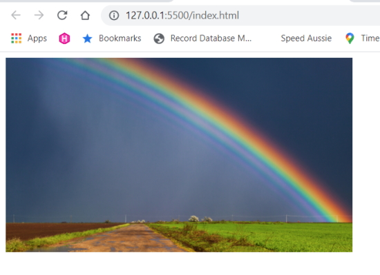
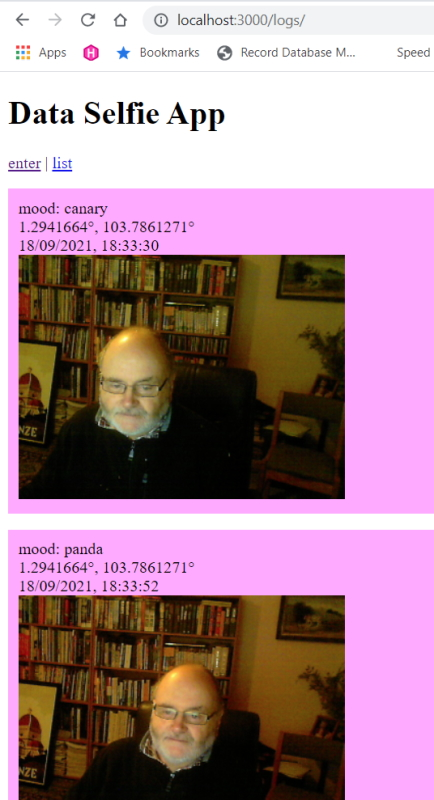
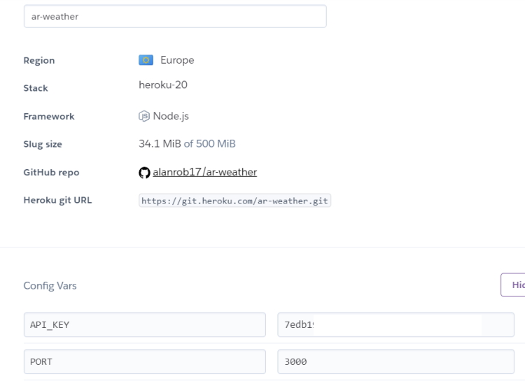
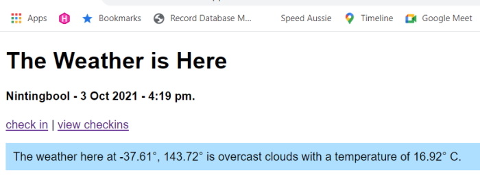
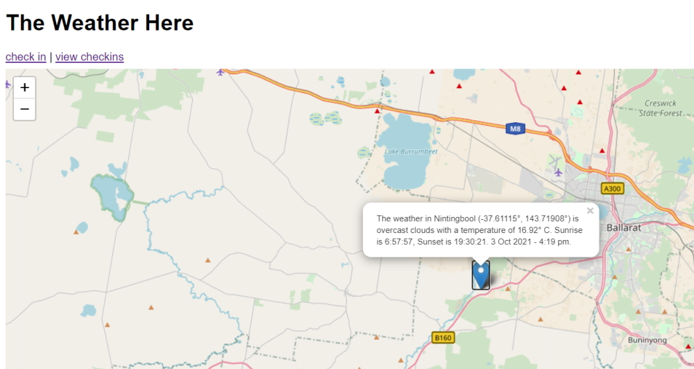

# Working With Data and API's in JavaScript

## The fetch() function

We call ``fetch()`` and get a response back. The response (**body**) is a stream of data. Our work doesn't end there because we need to read that data and store it in a format that we can use. This is what we call a complete data stream.

The data comes in different formats.

* Text
* Blob (image)
* Array of data
* JSON

In our example we are going to get a blob element and format it onto a HTML page.

Our first try using ``fetch()`` and chaining a promise to it.

```js
    console.log('About to fetch a rainbow!');

    fetch('images/rainbow.jpg').then((response) => {
        console.log(response);
    });
```

> About to fetch a rainbow!     
> Response {type: 'basic', url: 'http://127.0.0.1:5500/images/rainbow.jpg', redirected: false, status: 200, ok: true, …}

This shows what our response object looks like.

**Note:** in the promise there is only one argument (response) so in this case we could have left the parentheses off.

Now we can add another promise to get the blob object.

```js
    fetch('images/rainbow.jpg').then((response) => {
        console.log(response);
        return response.blob();
    }).then(blob => {
        console.log(blob);
    });
```

Returns.

> About to fetch a rainbow!     
> Response {type: 'basic', url: 'http://127.0.0.1:5500/images/rainbow.jpg', redirected: > false, status: 200, ok: true, …}      
> Blob {size: 246798, type: 'image/jpeg'}

We can now see the blob object being returned.

We can now attach that blob to the HTML element with the ID of *'rainbow'*.

```js
    fetch('images/rainbow.jpg').then((response) => {
        console.log(response);
        return response.blob();
    }).then(blob => {
        console.log(blob);
        document.getElementById('rainbow').src = blob;
    });
```

This doesn't work because the blob needs to be formatted into an image.

There is a JavaScript element that will take this blob and format it into an image element.

## URL.createObjectURL()

Checkout the MDN URL.createObjectURL() documentation on how this works.

```js
    fetch('images/rainbow.jpg').then((response) => {
        console.log(response)   
        return response.blob();
    }).then(blob => {
        console.log(blob);
        document.getElementById('rainbow').src = URL.createObjectURL(blob);
    });
```

This time we get the following response on the page.



This code is working but it is missing a number of features.

## Handling errors

The nice thing about chaining is that we can continue adding on a catch function to catch any errors that occur.

To see this work we are going to misspell the name of our image.

```js
    fetch('images/rainbow.jpg').then((response) => {
        console.log(response);
        return response.blob();
    }).then(blob => {
        console.log(blob);
        document.getElementById('rainbow').src = URL.createObjectURL(blob);
    }).catch(error => {
        console.log('error!');
        console.log(error);
    });
```

We have added a ``catch()`` block to catch any errors.

This code returns.

> About to fetch a rainbow!       
> Response        
> Blob        
> error!      
> TypeError: Cannot set properties of null (setting 'src') at index.html:21

When we look at line 21 we see that we have misspelled the ID.

We can condense the code and make it a bit more readable by using.

## async /await

``async`` is a keyword that means that our code will happen asynchronously.

If we want to use ``await`` we have to use it in the context of a function.

We will write a new function.

```js
    console.log('About to fetch a rainbow!');

    const catchRainbow = async () => {
        const response = await fetch('images/rainbow.jpg');
        const blob = await response.blob();
        document.getElementById('rainbow').src = URL.createObjectURL(blob);
    };

    catchRainbow().catch(error => {
        console.log('error!');
        console.log(error);
    });
```

Using ``async`` / ``await`` reduces the complexity of our code and makes it easier to read.

Our ``fetch()`` and ``response`` calls are done in one line of code.

We can still use our ``catch()`` method by chaining it to our ``catchRainbow()`` function.

This nice thing about this code is that it runs asynchronously. This means that it will wait until the response is **fetched** and wait until the blob has been returned by the response.

### Extra challenges

* add multiple images (use an array)
* instead of an image add a poem

## Retrieving data from a CSV

We are using a test CSV that is a subset of the real data file for testing.

```js
    const getData = async () => {
        const response = await fetch('test.csv');
        const data = await response.text(); 
        console.log(data);
    }

    getData();
```

Returns.

> Year,Glob,NHem,SHem,24N-90N,24S-24N,90S-24S,64N-90N,44N-64N,24N-44N,EQU-24N,24S-EQU,44S-24S,64S-44S,90S-64S       
> 1880,-.16,-.28,-.04,-.36,-.12,-.01,-.83,-.46,-.26,-.16,-.09,-.03,.05,.65      
> 1881,-.08,-.17,.01,-.33,.11,-.07,-.93,-.43,-.18,.09,.12,-.05,-.07,.57

We can break this CSV down into rows

```js
    const getData = async () => {
        const response = await fetch('test.csv');
        const data = await response.text(); 
    
        const table = data.split('\n');
    
        console.log(table);
    }

    getData();
```

Returns.

> 0: "Year,Glob,NHem,SHem,24N-90N,24S-24N,90S-24S,64N-90N,44N-64N,24N-44N,EQU-24N,> 24S-EQU,44S-24S,64S-44S,90S-64S"        
> 1: "1880,-.16,-.28,-.04,-.36,-.12,-.01,-.83,-.46,-.26,-.16,-.09,-.03,.05,.65"     
> 2: "1881,-.08,-.17,.01,-.33,.11,-.07,-.93,-.43,-.18,.09,.12,-.05,-.07,.57"        
> length: 3

If we want to remove the header row from the data we can do that with ``.slice()``.

```js
    const table = data.split('\n').slice(1);
```

Returns.

> 0: "1880,-.16,-.28,-.04,-.36,-.12,-.01,-.83,-.46,-.26,-.16,-.09,-.03,.05,.65"     
> 1: "1881,-.08,-.17,.01,-.33,.11,-.07,-.93,-.43,-.18,.09,.12,-.05,-.07,.57"        
> length: 2

Now, we only want the first two columns in each row, the *year* and the difference from the mean temperature.

```js
    const table = data.split('\n').slice(1);

    table.forEach(row => {
        const columns = row.split(',');

        const year = columns[0];
        const temp = columns[1];

        console.log(`Year: ${year} - Diff in mean temp: ${temp}`);
    });
```

Returns.

> Year: 1880 - Diff in mean temp: -.16      
> Year: 1881 - Diff in mean temp: -.08

Now that we are happy that we are returning the data that we need we can change to the real data CSV.

```js
    const getData = async () => {
        const response = await fetch('ZonAnn.Ts+dSST.csv');

        const data = await response.text(); 
        const table = data.split('\n').slice(1);

        table.forEach(row => {
            const columns = row.split(',');

            const year = columns[0];
            const temp = columns[1];

            console.log(`Year: ${year} - Diff in mean temp: ${temp}`);
        });
    }

    getData();
```

Returns.

> Year: 1880 - Diff in mean temp: -.16      
> Year: 1881 - Diff in mean temp: -.08      
> Year: 1882 - Diff in mean temp: -.10      
> ...       
> Year: 2018 - Diff in mean temp: .85       
> Year: 2019 - Diff in mean temp: .98       
> Year: 2020 - Diff in mean temp: 1.02

### Extra challenge

* Bring in your own set of data and display it to the console.

```js
    const getCoffeeData = async () => {
        const response = await fetch('./data/coffee.csv');
        const data = await response.text(); 
    
        const table = data.split('\n').slice(1);
    
        table.forEach(row => {
            const columns = row.split(',');
    
            const StoreNo = columns[0];
            const name = columns[1];
            const city = columns[5];
            const state = columns[6];
            const zip = columns[7];
    
            console.log(`Store No: ${StoreNo} - Name: ${name}, ${city}, ${state}, ${zip}`)  ;
        });
    }
    
    getCoffeeData();
```

Returns.

> Store No: 11854 - Name: Epping Main St, Epping, NH, 03042-2224        
> Store No: 79420 - Name: Stop & Shop-Exeter #204, Exeter, NH, 03833-2105       
> Store No: 3872 - Name: Target Greenland T-2530, Greenland, NH, 03840-2438     
> ...       
> Store No: 70341 - Name: Kowalski's - Eagan, Eagan, MN, 55122-2213     
> Store No: 76896 - Name: Super Target Apple Vly South ST-239, Apple Valley, MN, 55124-7286     
> Store No: 2619 - Name: Eagan-Cliff Rd., Suite 101, Eagan, MN

## Mapping data to a web page

In this example we are going to Add Leaflet.js to our project. We are going to add the position of the ISS space station to a map using Open Street Maps as our mapping layer.

We need to bring in the Leaflet.css and the Leaflet.js files. Add these to our header.

```html
    <link
      rel="stylesheet"
      href="https://unpkg.com/leaflet@1.4.0/dist/leaflet.css"
      integrity="sha512-puBpdR0798OZvTTbP4A8Ix/l+A4dHDD0DGqYW6RQ+9jxkRFclaxxQb/SJAWZfWAkuyeQUytO7+7N4QKrDh+drA=="
      crossorigin=""
    />
    <script
      src="https://unpkg.com/leaflet@1.4.0/dist/leaflet.js"
      integrity="sha512-QVftwZFqvtRNi0ZyCtsznlKSWOStnDORoefr1enyq5mVL4tmKB3S/EnC3rRJcxCPavG10IcrVGSmPh6Qw5lwrg=="
      crossorigin=""
    ></script>
```

In the body we will add the following HTML.

```html
    <h1>Where is the ISS?</h1>

    <p>
      latitude: <span id="lat"></span>°<br />
      longitude: <span id="lon"></span>°
    </p>

    <div id="issMap"></div>
```

The div with the "id=issMap" is where our map will reside.

In our script code we need to add the following to be able to show the map on the screen. We will use Open Street Maps for our mapping source.

```js
    const mymap = L.map('issMap').setView([0, 0], 1);
    const attribution = '&copy; <a href="https://www.openstreetmap.org/copyright">OpenStreetMap</a> contributors';

    const tileUrl = 'https://{s}.tile.openstreetmap.org/{z}/{x}/{y}.png';
    const tiles = L.tileLayer(tileUrl, { attribution });
    tiles.addTo(mymap);
```

The attribution is required and ``tileUrl`` will link us to Open Street Maps.

To be able to see the map we need to use.

```js
    L.tileLayer(tileUrl, { attribution });
```

Where ``L`` is a Leaflet object and ``.tileLayer`` is a Leaflet function requiring the Open Street Map URL and the attribution.

Next we add the tiles to our mapping div.

```js
    tiles.addTo(mymap);
```

### Adding a marker to our map

Leaflet can add any number of markers to our mapping layer. We will use one marker to track the movement of the ISS space station.

We can create an icon for our map.

```js
    const issIcon = L.icon({
      iconUrl: './images/iss200.png',
      iconSize: [50, 32],
      iconAnchor: [25, 16]
    });
```

Once again this uses a Leaflet method named ``.icon()``. This allows us to add an image as our icon.

We add the marker we created to the map with this code.

```js
    const marker = L.marker([0, 0], { icon: issIcon }).addTo(mymap);
```

To retrieve the ISS space stations position we use the following URL.

```js
    const api_url = 'https://api.wheretheiss.at/v1/satellites/25544';
```

If I type the URL directly into my browser it will bring back JSON data detailing where the IIS space station is currently positioned. The JSON below is a sample of the data.

```json
    {
        "name":"iss",
        "id":25544,
        "latitude":51.525874961197,
        "longitude":-92.619376682684,
        "altitude":427.57396267943,
        "velocity":27580.587403264,
        "visibility":"eclipsed",
        "footprint":4545.7973924638,
        "timestamp":1631601445,
        "daynum":2459471.7759838,
        "solar_lat":3.2978423085164,
        "solar_lon":79.541121690567,
        "units":"kilometers"
    }
```

We will use this data in an async function.

```js
    async function getISS() {
      const response = await fetch(api_url);
      const dataPoint = await response.json();
      const { latitude, longitude } = dataPoint; 
    
      marker.setLatLng([latitude, longitude]);
    
      if (firstTime) {
        mymap.setView([latitude, longitude], 2);
        firstTime = false;
      }
    
      document.getElementById('lat').textContent = latitude.toFixed(2);
      document.getElementById('lon').textContent = longitude.toFixed(2);
    }

      getISS();

      setInterval(getISS, 1000);
```

We need to set the view information the first time we call the ``getISS()`` function. To do this we will use an ``if`` statement to set the variable ``firstTime`` to false after the initial run.

We also want to continually receive the data so we can watch the space station move around the world. We can do this with the JavaScript ``setInterval()`` function. In our case we are running the function every second.

Note also in our function that we are deserializing our data point to just grab the latitude and longitude data.

```js
    const { latitude, longitude } = dataPoint;
```

This a cleaner way to get to our data than using.

```js
    latitude = dataPoint.latitude;
    longitude = dataPoint.longitude;
```

## Using Node.js

So far we are just using a single web page to run our programs as client side JavaScript. There are a number of things that you aren't able to so in client side JavaScript so now we are going to run server side JavaScript using Node.js.

### setup the project

In a new folder create an *index.js* file and a *public* folder with and *index.html* page.

Run.

```bash
    npm init
```

Install.

```bash
    npm install express --save
```

Install.

```bash
    npm install nodemon
```

Add this code to *index.js*.

```js
    const express = require('express');
    const app = express();

    app.listen(3000, () => { console.log('Listening at port 3000!') });

    app.use(express.static('public'));
```

This sets up a basic server so you can serve the *index.html* page.

## Using Geolocation

We can use the **Navigator** object in our browser to get geolocation points if it is allowed.

```js
    if ('geolocation' in navigator) {
        navigator.geolocation.getCurrentPosition((position) => {
            console.log(`${position.coords.latitude}, ${position.coords.longitud    `);  
        });
    } else {
        console.log('Geolocation not available');
    }
```

Returns.

> 1.2941664, 103.7861271

It is easy to display this data on the web page.

In the HTML.

```html
    <h3>Latitude: <span id="lat"></span>°<br/>Longitude: <span id="lon"></span>°</h3>
```

In the JavaScript.

```js
    if ('geolocation' in navigator) {
        navigator.geolocation.getCurrentPosition((position) => {
            const latitude = document.getElementById('lat');
            const longitude = document.getElementById('lon');
        
            latitude.innerHTML = position.coords.latitude;
            longitude.innerHTML = position.coords.longitude;
        });
    } else {
        console.log('Geolocation not available');
    }   
```

Previously we used Leaflet.js with Open Street Maps to view the ISS space station marker on the screen. Why not modify that code to display our location?

HTML.

```html
    <h4>Latitude: <span id="lat"></span>°<br/>Longitude: <span id="lon"></span>°</h4>
    
    <div id="locationMap"></div>
```

JavaScript.

```js
    if ('geolocation' in navigator) {
        navigator.geolocation.getCurrentPosition((position) => {            
            const mymap = L.map('locationMap').setView([0, 0], 1);
            const attribution = '&copy; <a href="https://www.openstreetmap.org/copyright">OpenStreetMap</a> contributors';
            const tileUrl = 'https://{s}.tile.openstreetmap.org/{z}/{x}/{y}.png';
            
            const tiles = L.tileLayer(tileUrl, { attribution });
            tiles.addTo(mymap);

            const getDataPoint = async () => {
                const latitude = position.coords.latitude;
                const longitude = position.coords.longitude;

                L.marker([latitude, longitude]).addTo(mymap)
                    .bindPopup(`This is my location.<br/>\tLatitude: ${latitude}°, longitude: ${longitude}°`);
                    
                mymap.setView([latitude, longitude], 5);
  
                document.getElementById('lat').textContent = latitude.toFixed(2);
                document.getElementById('lon').textContent = longitude.toFixed(2);            
            }

            getDataPoint();
        });
    } else {
        console.log('Geolocation not available');
    }
```

Result.


## HTTP Post request with Fetch()

We are now going to send data from the client to our server using a POST request.

We will be sending our latitude and longitude to the server.

At present we will just ``console.log()`` the data and eventually we will save this data in a database.

There are three parts required to do this.

### Routing

We need to create an endpoint that describes the address we are posting our data to.

### JSON parsing

When we send data we need to send it as JSON for the server to understand what it receives.

### POST with fetch()

We need to modify the fetch() request to post data to the server.

We start off with **routing** and that is either a GET or a POST. In our case it will be a POST because we are sending data to the server.

The route requires an address to where we want POST the data. once we receive the data on the server we will process it and then send back a response to the client.

Let's set up our request.

```js
    app.post('/api', (request, response) => {
        const data = request.body;
        response.json({
            status: 'Success!',
            latitude: data.latitude,
            longitude: data.longitude
        });
    });
```

We are POSTing the data to **/api**. Our function requires *request* and *response* parameters. *request* is the data we are sending to the server. *response* is what we are sending back to the client.

In this function we aren't doing anything with the data except creating a response that can be sent back to the client.

Now we need to go back to the client and send some data to our endpoint (/api) as a POST.

I will create a function named ``postLatLong()`` to POST my data.

```js
    const postLatLong = async (latitude, longitude) => {
        const data = { latitude, longitude };
            
        const options = {
            method: 'POST',
            body: JSON.stringify(data),
            headers: { 
                'Content-Type': 'application/json'
            }
        };

        const response = await fetch('/api', options);
        const json = await response.json();
        console.log(json);
    }
```

This function requires a latitude and longitude that can be used as our data for the POST.

We are using ``async``/``await`` to send and receive our data.

We will use the previous method of getting the latitude and longitude.

```js
    if ('geolocation' in navigator) {
        navigator.geolocation.getCurrentPosition((position) => {            
            const latitude = position.coords.latitude.toFixed(4);
            const longitude = position.coords.longitude.toFixed(4);

            document.getElementById('lat').textContent = latitude;
            document.getElementById('lon').textContent = longitude;

            postLatLong(latitude, longitude);
        }); 
    } else {
            console.log('Geolocation not available');
    }
```

Returns.

> {status: 'Success!', latitude: '-37.8012', longitude: '144.8870'}     
> latitude: "-37.8012"      
> longitude: "144.8870"     
> status: "Success!"        
> [[Prototype]]: Object

We can extend this example in preparation for the next task which is to persist the data into a database.

Create an array to save all of the data we have collected.

Create a submit button on the web page so we can save multiple location points.

## Saving to a database

We are going to use a lightweight database names NeDB. This is a subset of MongoDB that runs in memory and will save a database as a text file.

At present we are creating a geolocation point and dumping that to the console. We are going to add a submit button to our page so that we can log multiple points to the console.

We have also place our JavaScript in a separate file so that we now only see HTML in our page.

This is our new code.

```html
    <h1>Data Selfie App</h1>

    <div><a href="/">enter</a> | <a href="/logs">list</a></div>
    <p>
      latitude: <span id="latitude"></span>&deg;<br />
      longitude: <span id="longitude"></span>&deg;
    </p>
    <label for="mood">enter your mood</label>
    <input id="mood" value="rainbow" />
    <button id="submit">submit</button>
    <script src="sketch.js"></script>
```

Our page now looks like this.


When I click on submit it returns.

> geolocation available     
> 1.2941664 103.7861271     
> [[Prototype]]: Object     
> lat: 1.2941664        
> lon: 103.7861271      
> mood: "rainbow"       
> timestamp: 1631942239951

If I keep clicking on the submit button it will record multiple locations.

The problem is that when I close my web server down the points that I have submitted will be lost. We need to add persistance so will use a database.

[Check this site out for documentation.](https://github.com/louischatriot/nedb)

We can install with **npm**.

```bash
    npm install nedb
```

For a really detailed explanation on how to use NeDB check out this [link](https://stackabuse.com/nedb-a-lightweight-javascript-database/).

On the server site we need to call NeDB.

```js
    const Datastore = require('nedb');
```

Now we need to open the database named ``database.db``. This database is in our root application folder.

```js
    const database = new Datastore('database.db');
    database.loadDatabase();
```

At present the database doesn't exist but when we call, ``database.loadDatabase()`` it will create the database if it doesn't exist or load an existing database if it finds one.

Once I run this server the database will be created and I can look at it in a text editor. At present there is no data.

I can insert some data.

```js
    database.insert({ name: "Alan Robson", status: "working" });
    database.insert({ name: "Charley Robson", status: "playing" });
    database.insert({ name: "James Robson", status: "gaming" });
```

When I submit.

> {"name":"Alan Robson","status":"working","_id":"yEGUSr1BatwY4ry6"}        
> {"name":"Charley Robson","status":"playing","_id":"Qn5Fij1kegm6DKnH"}     
> {"name":"James Robson","status":"gaming","_id":"J76rcPSP8FluLzU5"}

**Note,** the **_id** value is unique and based on MongoDB. Each record in the database has an **_id**.

I don't want to leave this data in my database so I can use a text editor to delete it.

For our needs we can.

```js
    database.insert(data);
```

We will also add a timestamp into each database record.

```js
    const timestamp = Date.now();
    data.timestamp = timestamp;
```

our final POST request will be.

```js
    app.post('/api', (request, response) => {
        const data = request.body;
        const timestamp = Date.now();
        data.timestamp = timestamp;
        database.insert(data);
        response.json(data);
    });
```

## Querying the Database

To query the database we are going to add a new route to our server. This route will be a GET route.

We will still use the ``fetch()`` request but it is a simpler request. In our request we are going to query the database with the find command to bring back all records.

We are going to create a new web page named **logs/index.html** that will show a list of all records in our database. We have added a couple of more fields to the data to save our mood and a picture from our camera.

### log/index.html

```html
    <h1>Data Selfie App</h1>
    <div><a href="/">enter</a> | <a href="./logs">list</a></div>
    <script src="logs.js"></script>
```

### logs.js

```js
    const getData = async () => {
      const response = await fetch('/api');
      const data = await response.json();

      for (item of data) {
        const root = document.createElement('p');
        const mood = document.createElement('div');
        const geo = document.createElement('div');
        const date = document.createElement('div');
        const image = document.createElement('img');

        mood.textContent = `mood: ${item.mood}`;
        geo.textContent = `${item.lat}°, ${item.lon}°`;
        const dateString = new Date(item.timestamp).toLocaleString();
        date.textContent = dateString;
        image.src = item.image64;
        image.alt = 'Alan Robson making silly faces.';

        root.append(mood, geo, date, image);
        document.body.append(root);
      }
      console.log(data);
    }

    getData();
```

Page.



Console (image truncated).

> {"lat":1.2941664,"lon":103.7861271,"mood":"canary","image64":"data:image/png;base64,iVBORw0KG...kSuQmCC","timestamp":1631954010155,"_id":"HTb1PoRraDlOzyWq"}      
> {"lat":1.2941664,"lon":103.7861271,"mood":"wombat","image64":"data:image/png;base64,iVBORw0KG...kSuQmCC","timestamp":1631954022314,"_id":"dclODD52BbTHLgUk"}      
> {"lat":1.2941664,"lon":103.7861271,"mood":"panda","image64":"data:image/png;base64,iVBORw0KGg...kSuQmCC","timestamp":1631954032523,"_id":"cgCZqAWhGIuu0QBF"}

## Hiding our API keys

At present our API key is in our code and if we want to push our code to Github there is the potential of anybody having access to our API key.

Even worse than this is that we are using our API key in our front end which means that the key is easily seen by anybody looking at our code.

We need to hide the API key and other important bits of information. It would be preferable to add the API key to the environment.

To do this we are going to use the package, ``dotenv``.

```bash
    npm install dotenv
```

How ``dotenv`` works is explained on their website.

``dotenv`` is a zero-dependency module that loads environment variables from a ``.env`` file into ``process.env``. 

We create a ``.env`` file in our root folder.

```js
    PORT=3000
    API_KEY=7edb191eb003cf05b77aa1ee1a66f6a899
```

These are our hidden variables.

To get our hidden variables we add this line to our Node ``index.js`` file.

```js
    require('dotenv').config();
```

This allows us to load everything that is in a ``.env`` file into our code.

I can have a quick look at all of my environment variables with.

```js
    console.log(process.env);
```

> ACLOCAL_PATH: 'C:\\Program Files\\Git\\mingw64\\share\\aclocal;C:\\Program  Files\\Git\\usr\\share\\aclocal',     
>  ALLUSERSPROFILE: 'C:\\ProgramData',      
>  API_KEY: '7edb191eb003cf05b77aa1ee1a66f6a899',     
>  APPDATA: 'C:\\Users\\alanr\\AppData\\Roaming',       
>  'asl.log': 'Destination=file',

On our server you will be able to see all of our environment variables including the environment path for the computer.

We are only interested in the **API** and **PORT** keys.

**Note:** as this is a Node package it can only be seen on the server side. This causes us problems because we are using the API key on the client side so we will have to find a workaround.

To use these in our code.

```js
    app.listen(process.env.PORT, () => console.log(`listening at ${process.env.PORT}`));
```

I am also going to create a GET request to send the API key from the server to the client.

In our API (index.js) I have created a **GET** request.

```js
    app.get('/key', (request, response) => {
        return response.json({ "key": process.env.API_KEY });
    });
```

I call this in our client (/js/script.js).

```js
    const getAPIKey = () => {
      const request = new XMLHttpRequest();
      request.open('GET', '/key', false);
      request.send();

      if (request.readyState === 4 && request.status === 200) {
        const data = JSON.parse(request.responseText);
        return data.key;
      } else if (request.readyState === 4) {
        throw new Error('There was an error retrieving the data.');
      }
    }

    const apiKey = getAPIKey();

    console.log(apiKey);
```

This returns.

> 7edb191eb003cf05b77aa1ee1a66f6a899

Now we are able to use the key we retrieved from the server side and keep our API key hidden in our environment variables.

When we are ready to upload our files to Git we can hide our environment keys in the ``.gitignore`` file by adding this line.

#### .gitignore

```git
    node_modules
    .env
```

## Deploying on Heroku

We need to create a Github repository for our project. This will allow us to automatically push to Heroku.

Make sure you have the Heroku CLI installed on your PC.

Open up your Heroku account by typing in your command prompt.

```bash
    heroku login
```

This will ask you to open a browser window and it will send you to *heroku.com*.

On the Heroku dashboard you can create a new app. I will call mine ar-weather which matched my project.

I will use the Deploy page to setup my app. I can connect to Github from here and select the project that I want to use.

Click on *Enable Automatic deploys*.

Select the **main** branch and click on *Deploy branch*.

This will open a list of commands you need to invoke to connect your local git project to Heroku

in your terminal run this command to see your remote sites

```bash
    git remote -v
```

This should show you.

> heroku  https://git.heroku.com/ar-weather.git (fetch)     
> heroku  https://git.heroku.com/ar-weather.git (push)

It states that you are remoting to Github. You also need to remote to Heroku.

```bash
    heroku git:remote -a ar-weather
```

Now, run the remote command again.

> heroku  https://git.heroku.com/ar-weather.git (fetch)     
> heroku  https://git.heroku.com/ar-weather.git (push)      
> origin  https://github.com/alanrob17/ar-weather.git (fetch)       
> origin  https://github.com/alanrob17/ar-weather.git (push)

You are now connected to Heroku.

From the terminal you can push to Github.

```bash
    git push heroku master
```

This will compile the Heroku website. You don't really need to do this.

If I do a *git push* to Github it will automatically push to Heroku and the changes you have made should be reflected on your Heroku website.

### Installing your API_KEY on Heroku

Before you can run your project you have to setup your API key and port. You can do this in *settings* on the Heroku dashboard.

Click on **Reveal Config Vars** and add your keys in here.



You can also do this in the terminal.

```bash
    heroku config
```

If you don't see any environment variables you can.

```bash
    heroku config:set API_KEY=7edb191eb003cf05b77aa1ee1a66f6a899

    heroku config:set PORT=3000
```

This will also restart the app for you.

Now.

```bash
    heroku config
```

Will show you.

> === ar-weather Config Vars        
> API_KEY: 7edb191eb003cf05b77aa1ee1a66f6a899       
> PORT:    3000

Now you can run your website on.

> https://ar-weather.herokuapp.com

## Refactoring the project

We are going to take out the camera option and reformat our code so that we can add a map of all our database points with tooltips on each point.

The REST API code.

#### index.js

```js
    const express = require('express');
    const Datastore = require('nedb');
    const fetch = require('node-fetch');
    require('dotenv').config();

    const app = express();
    const port = process.env.PORT || 3000;
    app.listen(port, () => {
      console.log(`Starting server at ${port}`);
    });

    app.use(express.static('public'));
    app.use(express.json({ limit: '1mb' }));

    const database = new Datastore('database.db');
    database.loadDatabase();

    app.get('/api', (request, response) => {
      database.find({}, (err, data) => {
        if (err) {
          response.end();
          return;
        }
        response.json(data);
      });
    });

    app.post('/api', (request, response) => {
      const data = request.body;
      const timestamp = Date.now();
      data.timestamp = timestamp;

      database.insert(data);
      response.json(data);
    });

    app.get('/weather/:latlon', async (request, response) => {
      const latlon = request.params.latlon.split(',');

      const lat = latlon[0];
      const lon = latlon[1];

      const api_key = process.env.API_KEY;
      const weather_url = `https://api.openweathermap.org/data/2.5/weather?lat=${lat}&lon=${lon}&units=metric&  APPID=${api_key}`;
      const weather_response = await fetch(weather_url);
      const weather_data = await weather_response.json();

      const data = {
        weather: weather_data
      };
      response.json(data);
    });
```

## Main page

#### index.html

```html
  <body>
    <h1>The Weather is Here</h1>
    <h4><span id="location"></span> - <span id="currentDate"></span> - <span id="currentTime"></span></h4>
    <div>
      <a href="/">check in</a> | <a href="/checkins">view checkins</a>
    </div>
    <p>
      The weather here at <span id="latitude"></span>&deg;,
      <span id="longitude"></span>&deg; is <span id="summary"></span> with
      a temperature of <span id="temp"></span>&deg; C.
    </p>
    <script src="./index.js"></script>
  </body>
```

Main page code.

#### index.js

```js
    const timeConverter = timestamp => {
      const a = new Date(timestamp * 1000);
      const hour = a.getHours();
      const min = a.getMinutes();
      const sec = a.getSeconds();
      const time = hour + ':' + min + ':' + sec;
    
      return time;
    }

    const dateConverter = timestamp => {
      const a = new Date(timestamp * 1000);
      const months = ['Jan', 'Feb', 'Mar', 'Apr', 'May', 'Jun', 'Jul', 'Aug', 'Sep', 'Oct', 'Nov', 'Dec'];
      const year = a.getFullYear();
      const month = months[a.getMonth()];
      const date = a.getDate();
      const newDate = date + ' ' + month + ' ' + year;

      return newDate;
    }

    const getDate = lastRecorded => {
      lastRecorded = lastRecorded.substr(0, lastRecorded.indexOf('T'));
      
      if (lastRecorded !== '') {
        const last = lastRecorded.split('-');
        lastRecorded = `${last[2]}-${last[1]}-${last[0]}`
      }

      return lastRecorded;
    }

    const getTime = () => {
      const dt = new Date();
      let hours = dt.getHours();
      const minutes = dt.getMinutes();
      let timePostFix = 'am';

      if (hours === 12) {
        timePostFix = 'pm';
      } else if (hours > 12) {
        timePostFix = 'pm';
        hours = hours - 12;
      }

      return `${hours}:${minutes} ${timePostFix}.`;
    }

    // Geo Locate
    let lat, lon;
    
    if ('geolocation' in navigator) {
      console.log('geolocation available');
      navigator.geolocation.getCurrentPosition(async position => {
        let lat, lon, location, currentDate, currentTime, sunrise, sunset, weather;
        try {
          lat = position.coords.latitude;
          lon = position.coords.longitude;
          document.getElementById('latitude').textContent = lat.toFixed(2);
          document.getElementById('longitude').textContent = lon.toFixed(2);
          const api_url = `weather/${lat},${lon}`;
          const response = await fetch(api_url);
          const json = await response.json();
          weather = json.weather

          currentTime = getTime();

          const sunriseTime = weather.sys.sunrise;
          const sunsetTime = weather.sys.sunset;
          sunrise = timeConverter(sunriseTime);
          sunset = timeConverter(sunsetTime);
          currentDate = dateConverter(sunriseTime);
          location = weather.name;

          document.getElementById('summary').textContent = weather.weather[0].description;
          document.getElementById('temp').textContent = weather.main.temp;
          document.getElementById('location').textContent = location;
          document.getElementById('currentDate').textContent = currentDate;
          document.getElementById('currentTime').textContent = currentTime;
        } catch (error) {
          console.log(error);
        }

        const data = { lat, lon, location, currentDate, currentTime, sunrise, sunset, weather };
    
        const options = {
          method: 'POST',
          headers: {
            'Content-Type': 'application/json'
          },
          body: JSON.stringify(data)
        };
        
        const db_response = await fetch('/api', options);
        const db_json = await db_response.json();
      });
    } else {
      console.log('geolocation not available');
    }
```


## Map page

```html
    <!DOCTYPE html>
    <html lang="en">
      <head>
        <meta charset="UTF-8" />
        <meta
          name="viewport"
          content="width=device-width, initial-scale=1.0"
        />
        <meta http-equiv="X-UA-Compatible" content="ie=edge" />
        <link
          rel="stylesheet"
          href="https://unpkg.com/leaflet@1.4.0/dist/leaflet.css"
          integrity="sha512-puBpdR0798OZvTTbP4A8Ix/l+A4dHDD0DGqYW6RQ+9jxkRFclaxxQb/SJAWZfWAkuyeQUytO7+7N4QKrDh  +drA=="
          crossorigin=""
        />
        <script
          src="https://unpkg.com/leaflet@1.4.0/dist/leaflet.js"
          integrity="sha512-QVftwZFqvtRNi0ZyCtsznlKSWOStnDORoefr1enyq5mVL4tmKB3S/   EnC3rRJcxCPavG10IcrVGSmPh6Qw5lwrg=="
          crossorigin=""
        ></script>
        <style>
          #checkinMap {
            height: 480px;
            margin: 8px 0px;
          }
        </style>
        <link rel="stylesheet" type="text/css" href="../style.css" />
        <title>The Weather Here</title>
      </head>
      <body>
        <h1>The Weather Here</h1>
        <div>
          <a href="/">check in</a> | <a href="/checkins">view checkins</a>
        </div>
        <div id="checkinMap"></div>
        <script src="logs.js"></script>
      </body>
    </html>
```

#### logs.js

```js
    // set map co-ordinate to Alice Springs to the the map of Australia on the screen.
    const myMap = L.map('checkinMap').setView([-23.6993336, 133.8713537], 4);
    const attribution = '&copy; <a href="https://www.openstreetmap.org/copyright">OpenStreetMap</a> contributors';
    const tileUrl = 'https://{s}.tile.openstreetmap.de/tiles/osmde/{z}/{x}/{y}.png';
    const tiles = L.tileLayer(tileUrl, { attribution });
    tiles.addTo(myMap);

    getData();

    async function getData() {
      const response = await fetch('/api');
      const data = await response.json();

      for (item of data) {
        const marker = L.marker([item.lat, item.lon]).addTo(myMap);
        let message = `The weather in ${item.location} (${item.lat}&deg;,
        ${item.lon}&deg;) is ${item.weather.weather[0].description} with
        a temperature of ${item.weather.main.temp}&deg; C.
         Sunrise is ${item.sunrise}, Sunset is ${item.sunset}.
         ${item.currentDate} - ${item.currentTime}`;

        marker.bindPopup(message);
      }
    }
```


